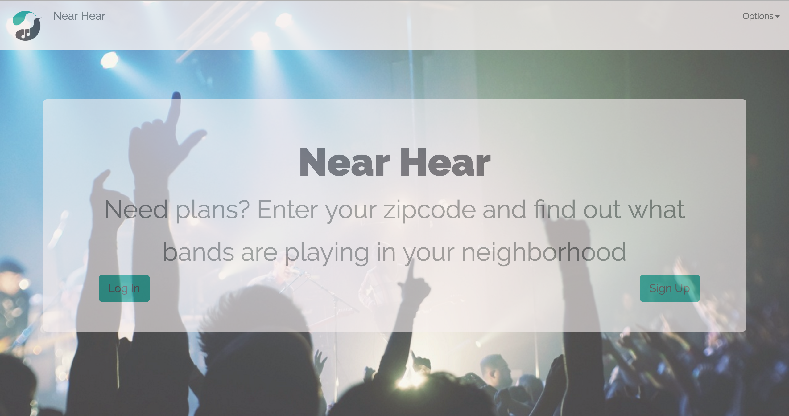
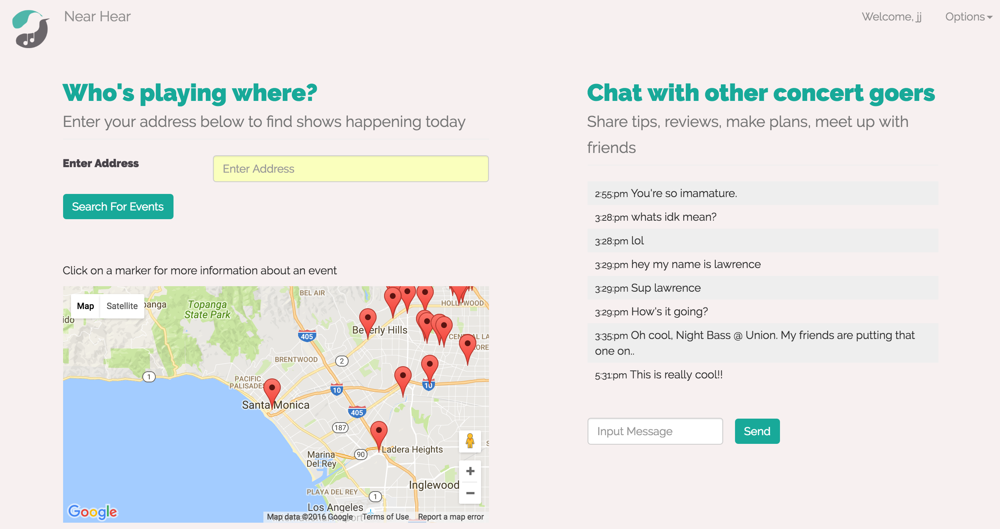

# Near Hear

[click here](https://nearhear.herokuapp.com)

### Screenshots

### Description

Near Hear connects users with bands playing by location using a convenient map interface.

* Each event has a live comment stream so users can find out what’s going on before they leave the house.
* When creating an account, users can set their default zip code and search events by any address.

### Technologies Used

* NodeJS + Express
* MongoDB + Mongoose
* JavaScript + jQuery
* AJAX
* Passport
* HTML
* CSS, Bootstrap

### Third-party API's Used
* [Google Maps](https://developers.google.com/maps/documentation/javascript/)
* [Bandsintown](https://www.bandsintown.com/api/overview)

### Other
Cooler, Trello, Heroku

### User Stories
* A user will be able to sign up for an account.
* A user will be able to login and logout of active account.
* A user will be able to edit their account info.
* A user will be able to delete their account.
* A user will be able to input an address and search for events happening around that address.
* Event search will return list of events matching search criteria and each event will be represented by a marker on a map so that location can be easily viewed.
* A user will be able to click each marker to be taken to an event page with more information about that event.
* The event details view will display in real-time event comments submitted by users. A user can add a comment(s) to the event page.

### Contributors
Nicholas Nemetz ([GitHub](https://github.com/nem1230)) and Susan Rotondo ( [GitHub](https://github.com/susanrotondo)) also contributed, particular to the incorporation of the API's. Original GitHub [here](https://github.com/jjkeith/Project3)

### Future Implementations

* Add another API to broaden the scope of searchable events.
* Edit and delete items on the saved events list.
* Add artist pictures on event detail pages.
