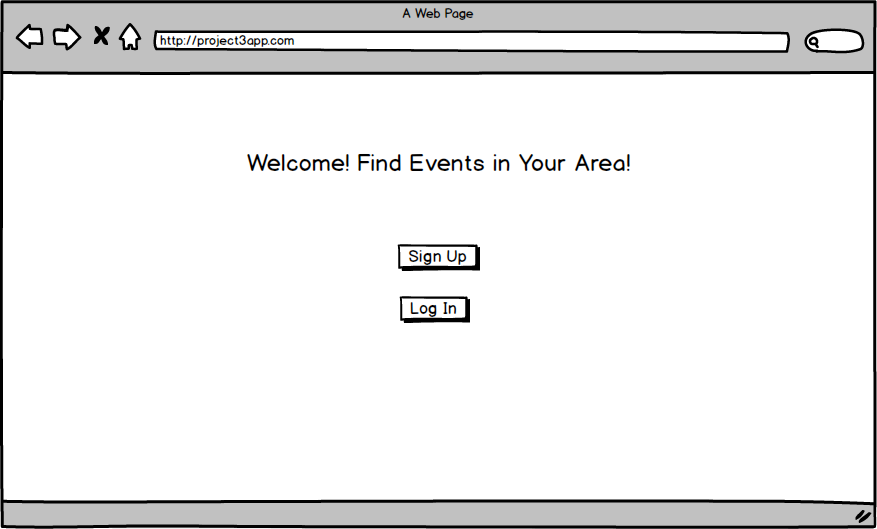
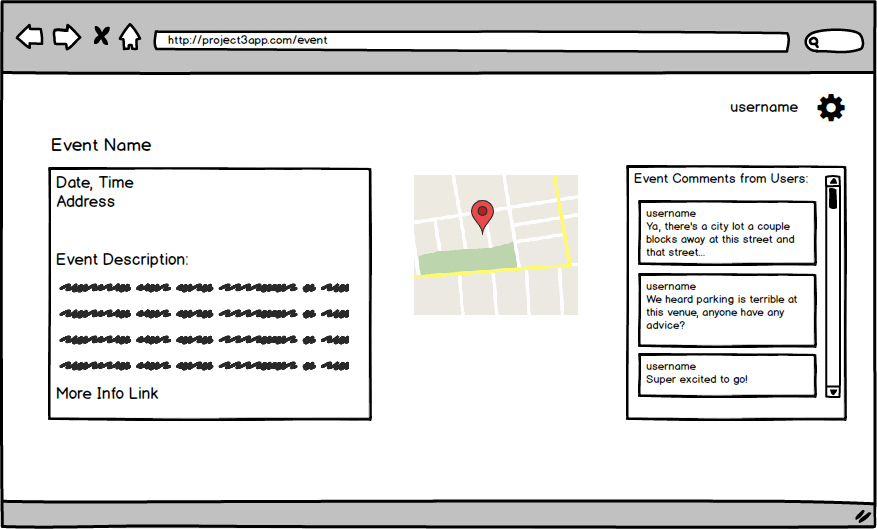

# Near Hear

[https://obscure-harbor-18966.herokuapp.com/](click here)

### Contributors
JJ Keith | Contact: jj@jjkeith.net [GitHub](https://github.com/jjkeith)

Nicholas Nemetz | Contact: n.nemetz1230@gmail.com [GitHub](https://github.com/nem1230)

Susan Rotondo | Contact: susanrotondo@gmail.com [GitHub](https://github.com/susanrotondo)

### Description

Near Hear connects users with bands playing by location using a convenient map interface.

* Each event has a live comment stream so users can find out what’s going on before they leave the house.
* When creating an account, users can set their default zip code and search events by any address.

### Technologies Used

* NodeJS + Express
* MongoDB + Mongoose
* JavaScript + jQuery
* AJAX
* Passport
* HTML
* CSS, Bootstrap

### Third-party API's Used
* [Google Maps](https://developers.google.com/maps/documentation/javascript/)
* [Bandsintown](https://www.bandsintown.com/api/overview)

### Other
Color palette picker: [cooler](https://coolors.co/app/484349-f7f0f0-8af3ff-18a999-109648)
[this list should include heroku, trello, etc]

### User Stories
* A user will be able to sign up for an account. 
* A user will be able to login and logout of active account.
* A user will be able to edit their account info.
* A user will be able to delete their account.
* A user will be able to input an address and search for events happening around that address. 
* Event search will return list of events matching search criteria and each event will be represented by a marker on a map so that location can be easily viewed. 
* A user will be able to click each marker to be taken to an event page with more information about that event. 
* The event details view will display in real-time event comments submitted by users. A user can add a comment(s) to the event page.

### Wireframes

### Future Implementations
